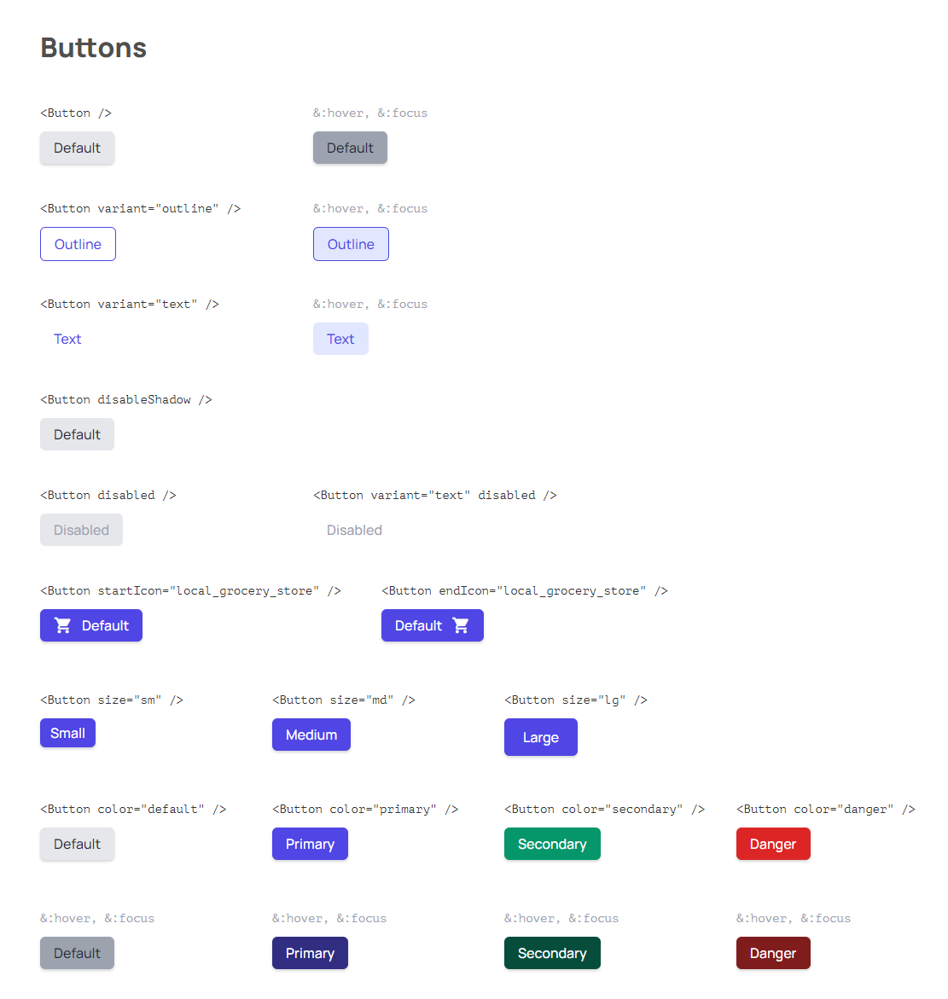

<h1 align="center">Button Component</h1>

<div align="center">
   Solution for a challenge from  <a href="http://devchallenges.io" target="_blank">Devchallenges.io</a>.
</div>

<div align="center">
  <h3>
    <a href="https://condescending-gates-d9d463.netlify.app/">
      Demo
    </a>
    <span> | </span>
    <a href="https://github.com/antoineterny/devchallenges-button-component">
      Solution
    </a>
    <span> | </span>
    <a href="https://devchallenges.io/challenges/ohgVTyJCbm5OZyTB2gNY">
      Challenge
    </a>
  </h3>
</div>

<!-- TABLE OF CONTENTS -->

## Table of Contents

- [Overview](#overview)
- [Features](#features)
- [How to use](#how-to-use)
- [Contact](#contact)
- [Acknowledgements](#acknowledgements)

<!-- OVERVIEW -->

## Overview

[](https://condescending-gates-d9d463.netlify.app/)

Very useful challenge, which taught me a lot about how to make the most of React by applying classNames by adding props.

## Features

<!-- List the features of your application or follow the template. Don't share the figma file here :) -->

This application/site was created as a submission to a [DevChallenges](https://devchallenges.io/challenges) challenge. The [challenge](https://devchallenges.io/challenges/ohgVTyJCbm5OZyTB2gNY) was to build an application to complete the given user stories.

## How To Use

<!-- Example: -->

To clone and run this application, you'll need [Git](https://git-scm.com) and [Node.js](https://nodejs.org/en/download/) (which comes with [npm](http://npmjs.com)) installed on your computer. From your command line:

```bash
# Clone this repository
$ git clone https://github.com/antoineterny/devchallenges-button-component

# Install dependencies
$ npm install

# Run the app
$ npm start
```

## Acknowledgements

<!-- This section should list any articles or add-ons/plugins that helps you to complete the project. This is optional but it will help you in the future. For example -->

- [An Introduction to Reusable Components and how to create Typography Component](https://blogs.devchallenges.io/posts/wZKx9Jr3LTQaTZ4HXqdw)   
Which gives all the keys to solving this challenge.
- [JedWatson's classnames](https://github.com/JedWatson/classnames#readme)   
Which proves to be extremely useful.
- [Taildwind's colors](https://tailwindcss.com/docs/customizing-colors)    
Beautiful and convenient palette.

## Contact

- Website [antoineteny.com](https://antoineterny.com/)
- GitHub [@antoineterny](https://github.com/antoineterny/)